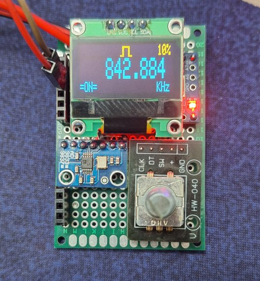

  
   
  <strong>Waveform generator</strong>

This is a waveform generator device using [AD9833](https://www.analog.com/media/en/technical-documentation/data-sheets/ad9833.pdf) that can generate Sinusoidal, triangular, and square wave outputs up to 12.5 MHz.

### Supplies
- Arduino pro mini (or a more capable arduino)
- SSD1306 display (128x32)
- Rotary encoder
- AD9833

### Instructions

WIP
